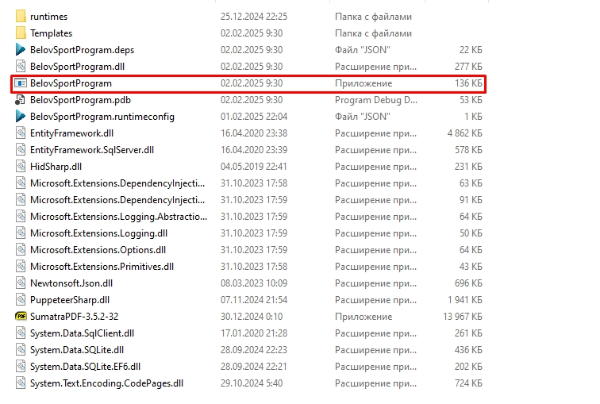
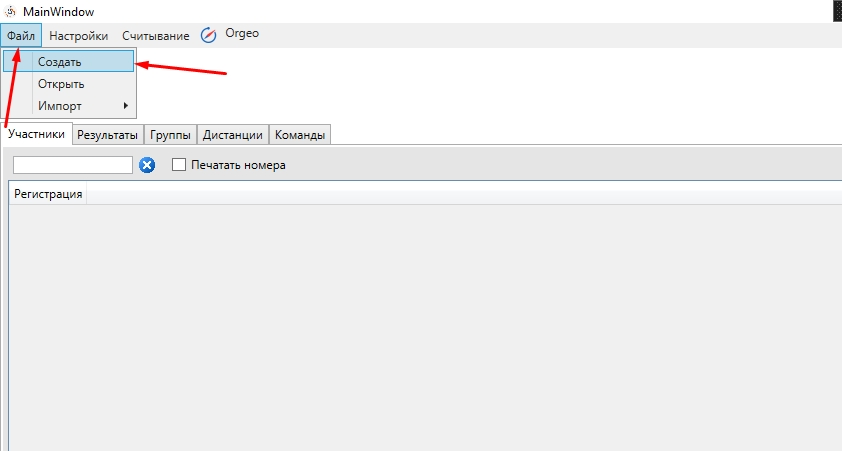

.. Belov Sport Program documentation master file, created by
   sphinx-quickstart on Sat Feb  1 23:12:16 2025.
   You can adapt this file completely to your liking, but it should at least
   contain the root `toctree` directive.
.. contents:: Оглавление
   :depth: 2
   :local:

Belov Sport Program
=================================

Документация актуальна на 1 февраля 2025г.

Установка
===========

1. Загрузить `.NET 8.0`_
2. Скачать_ архив с программой и распаковать в нужную вам папку на диске

.. warning:: 
  | Данная версия программы будет работать до **01.03.2025!**
  | После наступления данной даты программа не запустится!
  | **До наступления данной даты будет выложена новая версия программы, которая продолжит работу в будущем**
  | 
  | Данная мера используется, так как программа находится в **альфа-тестировании**

.. _`.NET 8.0`: https://dotnet.microsoft.com/en-us/download
.. _Скачать: https://disk.yandex.ru/d/nlPWrc6bFqnykg

Создание базы соревнований, первоначальные настройки
========================================================

1. Запускаем программу - ``BelovSportProgram`` 

2. С помощью меню ``Файл -> Открыть`` создаём новую базу 

3. Переходим в меню настроек ``Настройки -> Информация``

   .. image:: ../screens/settings_open.jpg

   1. В открывшемся окне заполняем информацию о предстоящих соревнованиях
   
   .. attention:: 
      | Дата задаётся в формате **мм/дд/гггг**
      | Время старта будет использовано для жеребьёвки участников

   .. image:: ../screens/settings_form.jpg

Импорт участников, дистанций и жеребьёвка
===========================================
1. Скачиваем с orgeo.ru данные в формате ``Excel CSV (кодировка Windows-1251)``
   
   .. image:: ../screens/orgeo_import.jpg

2. Для импорта участников в программе открываем импорт ``Файл -> Импорт -> Участники(CSV)``
  
   .. image:: ../screens/import_form.jpg
   
   1. В открывшем окне выбираем файл скачанный с orgeo.ru
   
   2. Открывается окно с данными, колонки автоматически сопоставились по названию

   .. image:: ../screens/import_settings.jpg

   .. note:: 
      | В ручную также можно сопоставить колонки, которые не распознались.
      | В нашем случае это - "ЧИП электронной отметки". Выберем колонку с названием "Аренда ЧИПа"

   .. image:: ../screens/column_set.jpg

   .. image:: ../screens/column_set_2.jpg

   3. Когда все нужные колонки сопоставлены нажимаем кнопку ``Записать информацию``
3. Для импорта участников в программе открываем импорт ``Файл -> Импорт -> Дистанции версии OCAD8 (текст)``

   .. warning:: 
      | Дистанции привязываются к соревновательному дню ``(сделано для удобства при проведении многодневок)``
      | Поэтому перед импортом дистанций нужно выбрать соревновательный день 
    .. image:: ../screens/days_change.jpg
   .. image:: ../screens/distance_import.jpg

4. Сопоставляем группы с дистанциями
   
   .. note::
      | Следует, также указать ``тип дистанции``
      | Это требуется при проверке результата участника, а также при печать сплита участника и протоколов.
      | В поле "Взнос" можно указать стартовый взнос, который будет отображён на закладке "Участники" при выбранном стартовом дне

   .. warning:: На данный момент реализовано только **Заданное направление**
   
   .. image:: ../screens/groups_distance.jpg

5. Для проведения жеребьёвки ``Настройки -> Жеребьёвка``

   .. image:: ../screens/jereb.jpg

   1. Добавление резерва

   .. note:: 
      | 1. Следует проставить галочку ``Добавлять резерв``
      | 2. Задать необходимые параметры для количества добавляемого резерва
      | 3. Нажать кнопку ``Добавить резерв`` 
      | При одновременном использовании двух параметров добавления резерва используется максимальное значение

   .. image:: ../screens/rezerve.jpg

   2. С помощью кнопок можно перетаскивать группы на доску планирования
   
   .. image:: ../screens/zereb.jpg

   3. На панели справа можно менять стартовый интервал и время начала старта, как для группы, так и для коридора в целом
   
   .. warning::
      На данный момент доступна только ``Жеребьёвка по командам``

   4. Когда всё введено нажимаем кнопку "Выполнить жеребьёвку"
   
На старте
============

1. Следует выбрать нужный нам соревновательный день
   
2. Доступен поиск участников
   
   Работает по полям:
      * Фамилия
      * Группа
      * Команда
      * Номер
  
   Поиск активируется после нажатия кнопки ``Enter(Ввод)``

   .. image:: ../screens/finder.jpg

3. При нажатии кнопки ``Зарегистрировать`` мы даём понять, что человек пришёл на старт и фиксируем данный факт в программе

   .. note:: 
      Зарегистрированные участники подсвечиваются оранжевым цветом

      .. image:: ../screens/registered.jpg

4. Печать номеров доступна прямо на старте, для этого нужно включить галочку ``Печать номера`` и выбрать нужный принтер.
   Номер будут печаться при нажатии кнопки "Зарегистрировать" 

   .. warning:: На данный момент доступна печать номеров размеров 75*120 на этикетках

   .. image:: ../screens/printBib.jpg

5. Кнопка "Печать" отвечает за формирование различных протоколов

   .. image:: ../screens/printInfo.jpg

   В открывшейся форме в выпадающем списке нужно выбрать нужный тип документа и нажать кнопку "Печать"

   .. image:: ../screens/print_1.jpg

   .. warning:: 
       | На данный момент доступны для формирования:
       |  Стартовый протокол
       |  Стартовая шахматка
       |  Протокол результатов
       |  Сплиты
  
Orgeo.ru 
==================

1. Отправка в Orgeo.ru осуществляется через вкладку меню ``Orgeo``

   .. image:: ../screens/orgeo.jpg

   * *Отправить стартовый протокол* - отправит стартовый протокол на выбранный день
   * *Отправить не стартовавших* - отправит участников, для которых не была не нажата кнопка ``Зарегистрировать``
   * *Отправить результаты* - отправит все результаты на выбранный день
